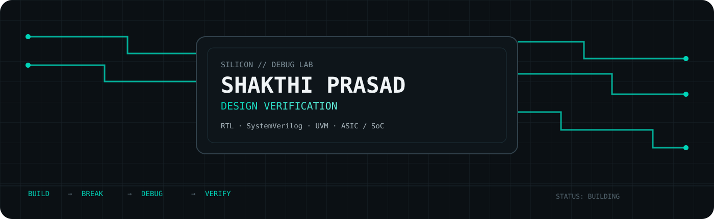
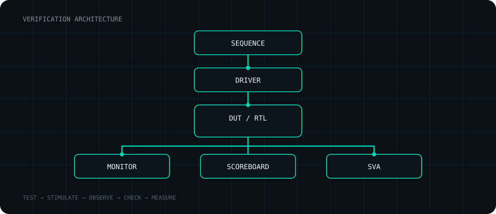
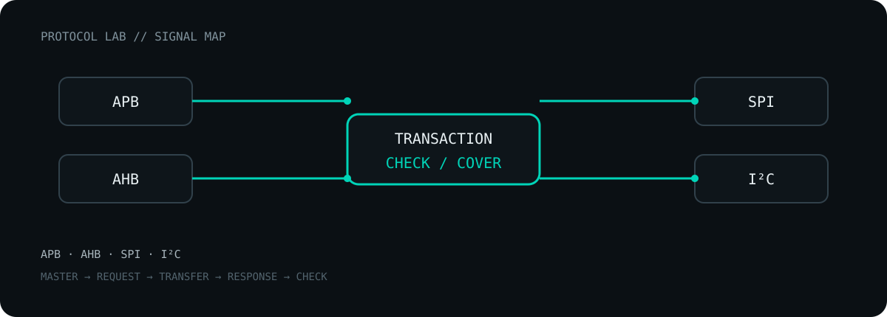
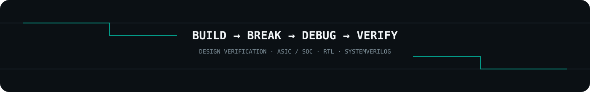

<div align="center">



<br>

<a href="https://www.linkedin.com/in/shakthiprasad243">

</a>
<a href="mailto:shakthiprasad243@gmail.com">

</a>

</div>

---

## `01 // SYSTEM PROFILE`

```text
┌─────────────────────────────────────────────────────────────┐
│                                                             │
│  NAME       : RAJUPETA SHAKTHI PRASAD                     │
│  ROLE       : VLSI DESIGN & VERIFICATION TRAINEE           │
│  CURRENT    : MAVEN SILICON                                │
│  LOCATION   : BENGALURU, INDIA                             │
│                                                             │
│  TARGET     : DESIGN VERIFICATION / ASIC / SOC             │
│                                                             │
└─────────────────────────────────────────────────────────────┘
```

I get more interested when something doesn't work as expected.

That curiosity pulled me toward **Design Verification**, where I enjoy understanding system behavior, creating scenarios that expose unexpected conditions, and tracking failures back to their root cause.

Currently building hands-on skills in **RTL design, SystemVerilog, UVM, constrained-random verification, functional coverage, SVA and protocol verification.**

---

## `02 // VERIFICATION FLOW`

<p align="center">

</p>

> **The goal isn't to prove that the design works once.  
> The goal is to find the ways it can fail.**

---

## `03 // CURRENT FOCUS`

| HARDWARE | VERIFICATION |
|---|---|
| RTL Design | UVM |
| Verilog | Constrained-Random |
| SystemVerilog | Functional Coverage |
| ASIC / SoC Flows | SVA |
| FPGA Flows | Debugging |
|  | Simulation |

### Protocols

`APB` · `AHB` · `SPI` · `I²C`

### Environment

`Linux` · `TCL` · `EDA Flows`

---

## `04 // PROTOCOL LAB`

<p align="center">

</p>

---

## `05 // ENGINEERING WORK`

### Maven Silicon
**Advanced VLSI Design & Verification Trainee**  
`June 2026 → Present`

Currently undergoing an intensive front-end ASIC/SoC design and verification program.

```text
RTL
 ↓
SystemVerilog
 ↓
Verification
 ↓
Constrained Random
 ↓
UVM
 ↓
Protocol Verification
 ↓
Debug
```

Hands-on areas include synthesizable Verilog RTL, SystemVerilog verification, constrained-random environments and scalable UVM testbench development.

### IIT Kanpur
**AI Web Application Developer / Research Intern**  
`January 2026 → March 2026`

Worked on the **NetZero Kuppam** project.

```text
Android Application
        ↓
Water Data Collection
        ↓
Interactive Dashboards
        ↓
Climate Data Analysis
        ↓
Research Findings
```

---

## `06 // PROJECT LAB`

> I use projects to turn concepts into things that can actually be tested.

### RTL
`FSM` · `Sequential Logic` · `Combinational Logic` · `Memory` · `Control Logic`

### Verification
`Testbenches` · `Assertions` · `Coverage` · `Scoreboards` · `Monitors` · `Constrained Random`

---

## `07 // RESEARCH`

### LoRa Vehicle-to-Vehicle Safety Communication

**Performance Characterization of LoRa-Enabled Vehicle-to-Vehicle Safety Communication in Dynamic Road Environments**

Research work focused on characterizing LoRa-based V2V safety communication under dynamic road conditions.

---

## `08 // BEYOND THE CHIP`

Before focusing on ASIC/SoC verification, my work also crossed into application development and research.

```text
ANDROID
   │
   ├── Data Collection
   ├── Dashboards
   └── Climate Data
          │
          ▼
       RESEARCH
          │
          ▼
         VLSI
          │
          ▼
 DESIGN VERIFICATION
```

Different domain.

Same engineering loop.

**Understand → Build → Test → Debug → Improve**

---

## `09 // GITHUB TELEMETRY`

<div align="center">


</div>

---

## `10 // ACTIVITY`

<div align="center">


</div>

---

<div align="center">



</div>
