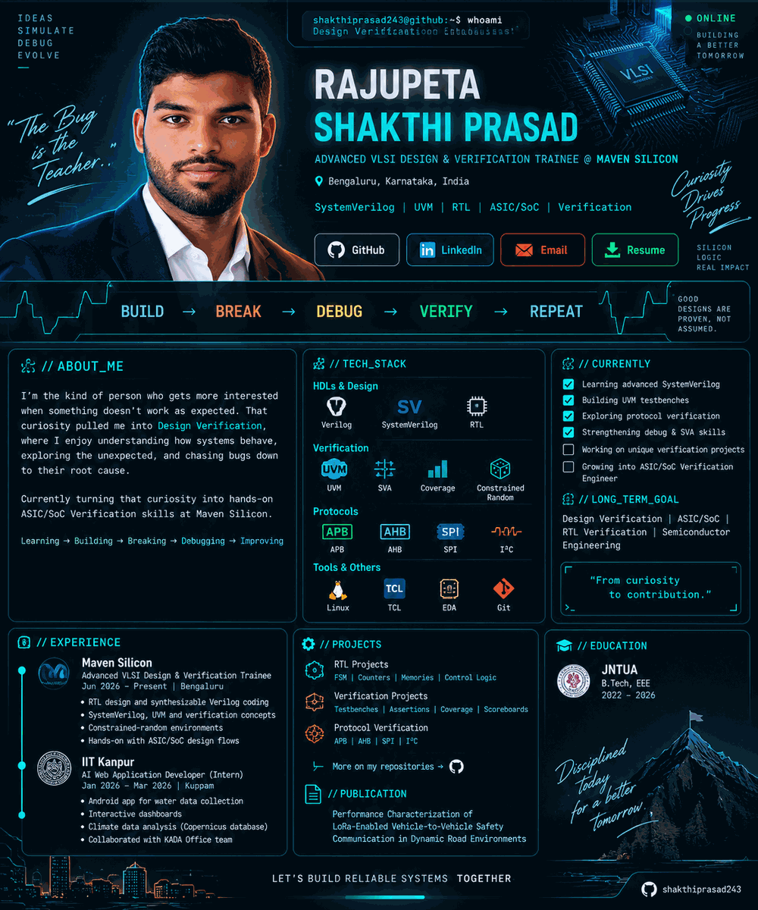

  

 

`BUILD → BREAK → DEBUG → VERIFY`

<!--
Accessible text version:

Shakthi Prasad is an Advanced VLSI Design & Verification Trainee at Maven Silicon.
Focus: SystemVerilog, UVM, Verilog, RTL Design, ASIC/SoC verification,
constrained-random verification, functional coverage, SVA, debugging,
simulation, APB, AHB, SPI, I²C, Linux, TCL and EDA flows.

Experience:
- Maven Silicon, Advanced VLSI Design & Verification Trainee, June 2026 - Present
- IIT Kanpur, AI Web Application Developer / Research Intern, January 2026 - March 2026

Education:
- JNTUA, B.Tech, Electrical, Electronics and Communications Engineering, 2022 - 2026

Publication:
- Performance Characterization of LoRa-Enabled Vehicle-to-Vehicle Safety Communication
  in Dynamic Road Environments
-->
